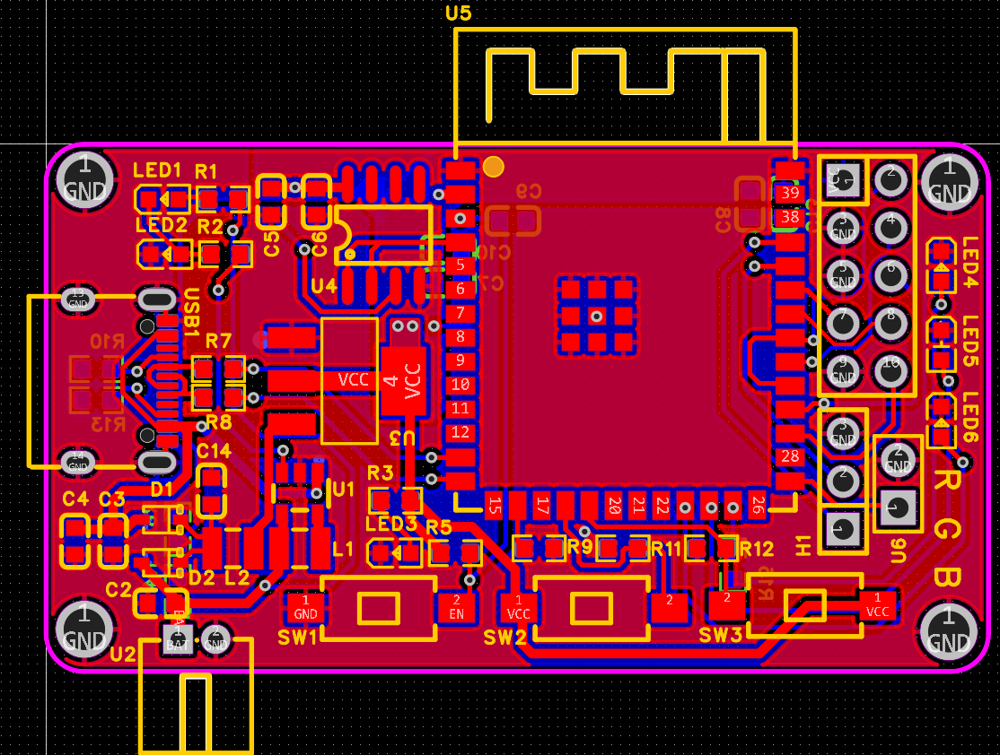

# ESP32S3DAP - 无线调试与编程适配器

## 项目简介

ESP32S3DAP是一个基于ESP32S3芯片的无线调试与编程适配器项目，它实现了通过无线网络（WiFi）进行SWD调试和编程的功能。该项目允许用户无需物理连接调试器，即可通过网络远程调试和编程微控制器。

## 项目结构

```
ESP32S3DAP/
├── Hardware/              # 硬件相关文件
│   ├── BOM.xlsx          # 物料清单
│   ├── ESPDAP.epro      # ESP32项目文件
│   ├── PCB.png          # PCB设计图
│   └── Schematic.png    # 原理图
└── Software/            # 软件代码
    └── wireless-esp32-dap/
        ├── CMakeLists.txt    # 项目构建配置
        ├── main/             # 主程序代码
        ├── components/       # 组件库
        ├── circuit/          # 电路相关代码
        ├── idf.py            # ESP-IDF工具脚本
        ├── sdkconfig*        # SDK配置文件
        └── README.md         # 软件说明文档
```

## 功能特点

1. **无线调试**：通过WiFi实现SWD调试协议，支持远程调试
2. **网络传输**：支持TCP和KCP两种网络传输协议
3. **USBIP协议**：实现了USBIP协议，可与兼容的调试软件配合使用
4. **串口桥接**：可选的串口桥接功能，通过网络访问目标设备的串口
5. **OTA升级**：支持固件空中升级功能

## 硬件要求

- 主控芯片：ESP32-S3
- PCB设计文件已包含在Hardware目录
- 所需元器件清单见Hardware/BOM.xlsx

## 软件要求

- ESP-IDF v5.4.2
- 支持的操作系统：Windows、Linux、macOS

## 编译与烧录

### 环境准备

1. 安装ESP-IDF v5.4.2
2. 设置ESP-IDF环境变量
3. 确保已安装必要的依赖项

### 编译步骤

1. 进入Software/wireless-esp32-dap目录
2. 运行以下命令：
   ```
   idf.py build
   ```

### 烧录步骤

1. 连接ESP32S3开发板
2. 运行以下命令：
   ```
   idf.py -p /dev/ttyUSB0 flash monitor
   ```

## 配置选项

### WiFi配置

在`main/wifi_configuration.h`中配置WiFi网络信息：

```c
static struct {
    const char *ssid;
    const char *password;
} wifi_list[] = {
    {.ssid = "你的WiFi名称", .password = "你的WiFi密码"},
    // 可添加多个WiFi网络
};
```

### DAP配置

在`main/dap_configuration.h`中配置DAP相关选项：

- `USE_WINUSB`：是否使用WinUSB协议（默认为1）
- `USE_SPI_SIO`：是否启用SPI SIO模式（默认为1）
- `USE_USB_3_0`：是否启用USB 3.0（默认为0）
- `DAP_PACKET_SIZE`：DAP数据包大小
- `USE_FORCE_SYSRESETREQ_AFTER_FLASH`：是否强制系统复位（默认为0）

### 网络配置

- 默认端口：3240
- 支持静态IP配置
- 可选mDNS服务（默认关闭）

## 使用说明

1. 硬件连接：
   - 将目标设备连接到ESP32S3DAP的SWD接口
   - 确保目标设备供电正常

2. 网络连接：
   - ESP32S3DAP启动后会自动连接配置的WiFi网络
   - 获取IP地址后，可通过网络连接进行调试

3. 调试软件配置：
   - 在调试软件中设置网络连接，IP地址为ESP32S3DAP的IP
   - 端口默认为3240
   - 使用SWD调试协议

## 注意事项

1. 烧录功能尚未完全测试
2. 串口功能默认关闭，如需使用请修改`USE_UART_BRIDGE`为1
3. 确保目标设备与ESP32S3DAP的SWD接口正确连接
4. 建议在调试前先测试基本连接功能

## 开发团队

- 项目基于wireless-esp32-dap项目修改，适配ESP32S3芯片
- 使用ESP-IDF v5.4.2环境编译成功测试

## 许可证

项目遵循相应的开源许可证，详见Software/wireless-esp32-dap/LICENSE文件。
